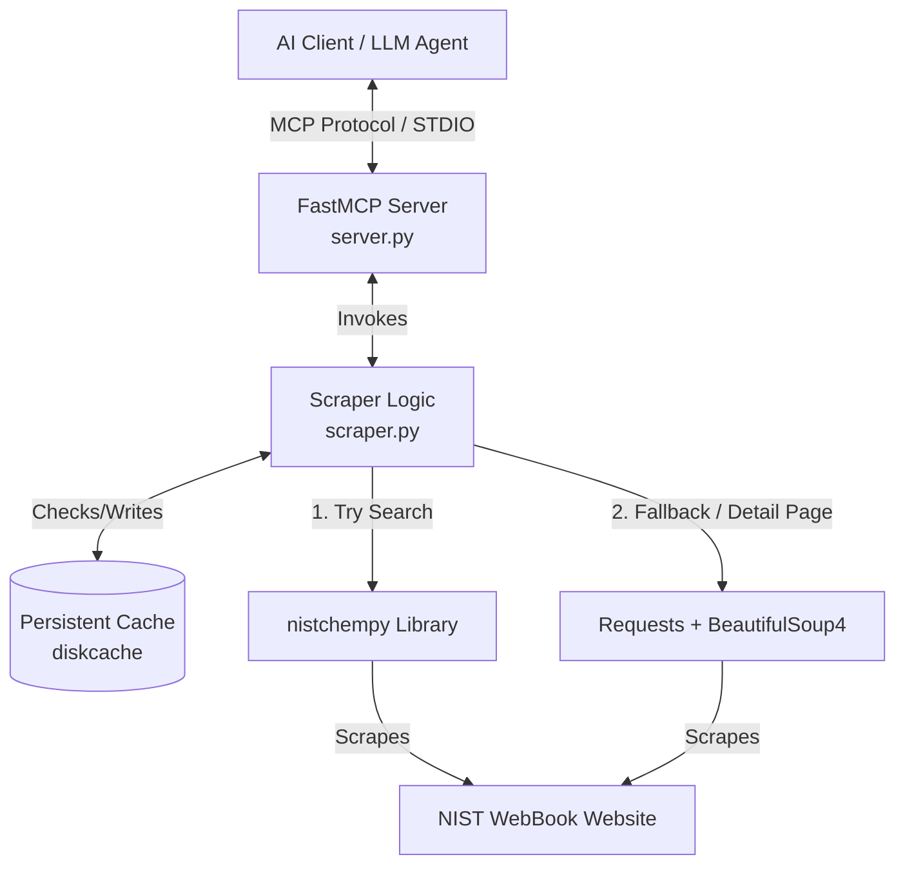

# NIST Chemistry WebBook MCP Server: Technical Deep Dive & Context (v1.0.0)

This document provides a comprehensive, production-grade technical breakdown of the **NIST Chemistry WebBook MCP Server**. It is structured specifically as an high-fidelity context document for Large Language Models (LLMs) and expert developers/chemical engineers to thoroughly discuss, audit, and extend the project.

---

## 1. Executive Summary & Design Philosophy

### The Gap & The Solution
The **NIST Chemistry WebBook** (webbook.nist.gov) is the gold standard, peer-reviewed public database for thermodynamic and physical chemistry property data. It is a critical dependency for chemical engineers, material scientists, and simulation pipelines (such as Aspen Plus, COMSOL, or MATLAB). However, designed in the 1990s, the WebBook has no official API, only complex, multi-phase, non-standardized HTML pages.

Under YC's "Software for Agents" framing, this Model Context Protocol (MCP) server bridges that gap. By translating erratic, unstructured HTML into deterministic, machine-readable JSON payloads over standard MCP tools, it enables LLMs and automated workflows to interact directly with authoritative thermodynamic data.

### Architectural Decisions
*   **Protocol Standard**: MCP 1.0.0, built on Anthropic's `mcp` SDK using the high-level **FastMCP** framework.
*   **Transport Mechanism**: **STDIO**, allowing local LLM clients (like Claude Desktop) to invoke tools via secure stdin/stdout redirection.
*   **Scraping Model**: A hybrid, multi-tier search resolver:
    1.  **High-Performance Library**: Tries the unofficial Python wrapper `nistchempy` first to resolve queries and fetch basic data.
    2.  **Scraping Fallback**: Falls back to direct HTTP requests and robust `BeautifulSoup4` parsing when `nistchempy` hits search limits, encounters empty results, or crashes.
*   **Caching Strategy**: Local filesystem persistent caching via `diskcache` to avoid redundant NIST server hits, respect rate limits, and provide sub-millisecond local response times for repetitive queries.

---

## 2. System Architecture



---

## 3. Project Dependencies & Configuration

### `pyproject.toml`
The project uses the modern PEP 517 build system with `hatchling` as the build backend, managed natively via **`uv`**.

```toml
[project]
name = "nist-mcp"
version = "0.1.0"
description = "MCP server for the NIST Chemistry WebBook"
readme = "README.md"
requires-python = ">=3.11"
dependencies = [
    "mcp[cli]",
    "nistchempy",
    "requests",
    "beautifulsoup4",
    "diskcache",
]

[project.scripts]
nist-mcp = "nist_mcp.server:main"

[build-system]
requires = ["hatchling"]
build-backend = "hatchling.build"

[tool.hatch.build.targets.wheel]
packages = ["src/nist_mcp"]

[dependency-groups]
dev = [
    "pytest",
    "pytest-mock",
    "responses",
]
```

### Environment Variables
*   **`NIST_CACHE_DIR`**: Local path for `diskcache` storage. Defaults to `~/.cache/nist-mcp`.
*   **`NIST_CACHE_TTL_SECONDS`**: Cache expiration threshold. Defaults to `86400` (24 hours).

---

## 4. MCP Tools & Input/Output Schemas

### `search_compound`
Performs a unified query lookup to resolve a string identifier to a canonical compound.

*   **Parameters**:
    *   `query` (string, required): The compound identifier (e.g., `"water"`, `"C2H6O"`, `"64-17-5"`).
    *   `search_by` (string, optional): One of `"name"`, `"formula"`, `"cas"`. Defaults to `"name"`.
*   **Return Payload Schema**:
    ```json
    {
      "name": "Ethanol",
      "cas": "64-17-5",
      "formula": "C2H6O",
      "molecular_weight": 46.068,
      "available_data": ["thermochemical_gas", "thermochemical_condensed", "phase_change"]
    }
    ```

### `get_thermodynamic_properties`
Retrieves comprehensive thermodynamic profiles, standard state data, and multi-range, multi-phase Shomate parameters.

*   **Parameters**:
    *   `cas` (string, required): The CAS number or NIST ID (e.g., `"64-17-5"`).
*   **Return Payload Schema**:
    ```json
    {
      "compound": {
        "name": "Water",
        "cas": "7732-18-5",
        "formula": "H2O",
        "molecular_weight": 18.0153
      },
      "shomate": [
        {
          "phase": "gas",
          "T_min": 500.0,
          "T_max": 1700.0,
          "A": 30.092, "B": 6.832514, "C": 6.793435,
          "D": -2.534480, "E": 0.082139, "F": -250.881,
          "G": 223.3967, "H": -241.8264,
          "units": "J/(mol*K)",
          "equation": "Cp° = A + B*t + C*t² + D*t³ + E/t²  (t = T/1000)"
        }
      ],
      "standard_state": {
        "Hf_kJ_per_mol": -285.83,
        "Gf_kJ_per_mol": null,
        "S298_J_per_mol_K": 69.95,
        "Cp298_J_per_mol_K": null
      },
      "phase_change": {
        "T_boil_K": 373.15,
        "T_fus_K": 273.15,
        "dHvap_kJ_per_mol": 40.65,
        "dHfus_kJ_per_mol": 6.01
      }
    }
    ```

### `get_phase_change_data`
Dedicated endpoint to fetch phase transitions and empirical Antoine parameters for vapor pressure calculations.

*   **Parameters**:
    *   `cas` (string, required): The CAS Registry Number or NIST ID.
*   **Return Payload Schema**:
    ```json
    {
      "phase_change": {
        "T_boil_K": 351.5,
        "T_fus_K": 159.0,
        "dHvap_kJ_per_mol": 42.3,
        "dHfus_kJ_per_mol": 4.973
      },
      "antoine": [
        {
          "T_min": 364.8,
          "T_max": 513.91,
          "A": 4.92531,
          "B": 1432.526,
          "C": -61.819
        }
      ]
    }
    ```

---

## 5. WebBook Scraper & Parser Mechanics (`scraper.py`)

Parsing the NIST WebBook is the core engineering challenge of this project due to its inconsistent and transposed table layouts. Below is a deep dive into how these tables are processed.

### NIST URL & Mask System
NIST controls data visibility on a single compound page using bitmask parameters. This server selectively targets these masks to save parsing overhead and fetch precise chunks of data:
*   `Mask=1`: Gas-phase thermochemistry data ($H_f^\circ$, $S_{298}^\circ$, Shomate).
*   `Mask=2`: Condensed-phase thermochemistry data ($C_p^\circ$ liquid/solid, phase Shomate).
*   `Mask=4`: Phase change data (Boiling/melting points, Enthalpy of Vaporization/Fusion, Antoine parameters).
*   `Mask=7`: Aggregated mask (`1 | 2 | 4`) used to fetch gas, condensed, and phase change data simultaneously in a single, high-efficiency network round-trip.

---

### The Transposed Shomate Coefficient Parsing Challenge
**The Problem**:
Standard HTML tables typically list entries row-by-row (e.g., each row is a separate data point, columns are properties). However, NIST represents Shomate coefficient tables in a **transposed** manner:
*   **Rows** represent the coefficient variables (`A`, `B`, `C`, `D`, `E`, `F`, `G`, `H`) and metadata (e.g., `Temperature (K)`).
*   **Columns** represent the separate temperature validity ranges for which those coefficients are defined.

A standard row-by-row table parser would completely garble this representation.

**The Solution (`_parse_shomate_tables`)**:
1.  **Row Mapping**: The parser scans the table and builds a temporary dictionary of row headers mapping the stripped header name (e.g. `A`, `B`, `TemperatureK`) to the corresponding HTML table row element (`<tr>`).
2.  **Phase Identification**: The parser back-tracks to sibling headers (`<h2>`, `<h3>`, `<h4>`) and checks `aria-label` attributes to determine if the coefficients apply to the `"gas"`, `"liquid"`, or `"solid"` phase.
3.  **Column-Wise Zipping**: It extracts the `Temperature (K)` row to determine how many validity ranges (columns) exist. For each column index `i`:
    *   It parses the range string (e.g., `"500.0 to 1700.0"`) into `T_min = 500.0` and `T_max = 1700.0`.
    *   It zips down the list of row variables (`A` through `H`), extracting the `i`-th cell (`<td>`) in each row, parsing it into a clean float.
    *   It packages them into a structured coefficient dictionary and appends it to the result set.

*Shomate Equation Reference implemented:*
$$C_p^\circ = A + B \cdot t + C \cdot t^2 + D \cdot t^3 + \frac{E}{t^2}$$
$$H^\circ - H_{298.15}^\circ = A \cdot t + B \cdot \frac{t^2}{2} + C \cdot \frac{t^3}{3} + D \cdot \frac{t^4}{4} - \frac{E}{t} + F - H$$
$$S^\circ = A \cdot \ln(t) + B \cdot t + C \cdot \frac{t^2}{2} + D \cdot \frac{t^3}{3} - \frac{E}{2 \cdot t^2} + G$$
*(Where $t = T/1000$ in Kelvin, $C_p^\circ$ is in $\text{J}/(\text{mol}\cdot\text{K})$, and enthalpies are in $\text{kJ}/\text{mol}$).*

---

### Standard State Parsing (`_parse_standard_state_tables`)
*   **Target Tables**: One-dimensional tables labeled with class `data` or matching aria labels under `Thermo-Gas` and `Thermo-Condensed` sections.
*   **Layout**: Each row lists a Quantity (e.g. `ΔfH°`), Value (e.g. `-241.82 ± 0.04`), and Units (e.g. `kJ/mol`).
*   **Quantity Normalization**: Because NIST uses standard thermodynamic symbols (Greek delta `Δ`, superscript degree `°`), the parser matches against clean unicode ranges:
    *   Enthalpy of Formation ($H_f^\circ$): Matches `ΔfH°`, `DfH°`, `dfH°`.
    *   Gibbs Energy of Formation ($G_f^\circ$): Matches `ΔfG°`, `DfG°`, `dfG°`, `ΔgG°`.
    *   Entropy ($S_{298}^\circ$): Matches `S°` or `S298`.
    *   Heat Capacity ($C_{p,298}^\circ$): Matches `Cp°` or `Cp,`.

---

### Phase Transitions & Antoine Parameters
*   **Antoine Equation parameters**: Extracted from tables nested directly under `<h3>Antoine Equation Parameters</h3>`.
    *   **Temperature Range extraction**: Translates a string like `"364.8 to 513.91"` into `T_min` and `T_max` float coordinates.
    *   **Parameter parsing**: Extracts standard parameters `A`, `B`, and `C` into valid numerical types.
*   **Enthalpies of Fusion & Vaporization**: If these values are missing from the primary phase change tables, the parser performs a recursive search for `<h3>Enthalpy of vaporization</h3>` and `<h3>Enthalpy of fusion</h3>` headings, fetching values from their immediate sub-tables.

---

### Float Parsing & Uncertainty Stripping (`_parse_float`)
Thermodynamic values in NIST are often represented with experimental uncertainties (e.g. `-241.826 ± 0.040` or `159. ± 2.`).
The custom parser split-strips the value:
1.  Splits the string by the `±` symbol.
2.  Takes the first partition (the nominal value).
3.  Removes any trailing dots, spaces, or non-numeric characters (while preserving signs `-`, `+`, decimal dots `.`, and scientific exponent notation `e` / `E`).
4.  Converts the result to a float.

---

## 6. Local Persistent Caching (`cache.py`)

To prevent aggressive, repeated queries to NIST (which can trigger IP blocks or rate limits), the server wraps web-facing operations in a persistent caching layer:

*   **Library**: `diskcache.Cache`, which relies on a thread-safe, process-safe SQLite database underneath.
*   **Caching Decorator (`@cached`)**:
    *   Applied to `_fetch_nist_page` to intercept raw HTML lookups.
    *   **Key Design**: Formulates a unique string key using the function's name and its sorted parameters:
        ```python
        key_parts = [fn.__name__]
        for arg in args:
            key_parts.append(str(arg))
        for k, v in sorted(kwargs.items()):
            key_parts.append(f"{k}:{v}")
        key = ":".join(key_parts)
        ```
    *   **Error Handling**: If filesystem access is restricted (e.g., locked directories on Windows), it catches the exception, logs a warning, and bypasses caching dynamically to allow execution to proceed.

---

## 7. Error Handling & Robustness

The server maintains a rigid error boundary to ensure client stability:
1.  **Unified Exception Hierarchy**:
    *   `scraper.py` defines `ScraperError` for all parse errors, network timeouts, and search ambiguities.
    *   `server.py` maps `ScraperError` (and unexpected errors) to `mcp.server.fastmcp.ToolError`.
    *   This ensures that the AI client receives a structured error message explaining *what* went wrong (e.g., `"Ambiguous query 'ethanol' — 3 matches found: ..."`), rather than a raw Python traceback.
2.  **Ambiguity Resolution**:
    *   If a search query yields multiple compounds, the server raises a clean error presenting up to 10 potential CAS matching options. This allows the AI agent to dynamically reformulate its query and ask the user or self-correct to pick a CAS.

---

## 8. Automated Verification Suite (`tests/`)

The server has a high-coverage unit test suite (`pytest`) checking all scraping and parsing edge cases without touching the live NIST servers:

*   **`tests/conftest.py`**: Declares mock HTML fixtures reflecting exact NIST layouts for Shomate, standard-state, and phase change pages.
*   **`tests/test_scraper.py`**:
    *   Verifies `_parse_float` with experimental error bounds (`"159. ± 2."`, `"-241.826 ± 0.040"`, etc.).
    *   Verifies `_normalize_cas` (removes hyphens, prepends `C` to CAS identifiers for NIST compatibility).
    *   Verifies the transposed Shomate table column-zipping logic.
    *   Verifies standard-state, phase change, and Antoine parameter extraction.
*   **`tests/test_server.py`**: Mocks the scraper to verify tool schemas, return values, and `ToolError` translation boundaries inside the FastMCP server.

To run:
```bash
uv run pytest
```

---

## 9. Known Quirks, Nuances, and Edge Cases

When discussing or building on this version, keep the following quirks in mind:

### 1. Phase Prioritization in Standard State Data
*   **The Issue**: If a compound contains standard state thermochemistry tables for both gas and condensed phases on the page, the parser merges them into a single `standard_state` payload.
*   **Example (Water)**: Water has standard state data for gas (Enthalpy of formation = $-241.83\text{ kJ/mol}$) and condensed/liquid (Enthalpy of formation = $-285.83\text{ kJ/mol}$). In v1, the combined `Mask=7` fetch loads both. The sequential parser iterates through the gas section, then the condensed section. The condensed value overwrites the gas value, resulting in $-285.83\text{ kJ/mol}$ being returned as standard enthalpy of formation.
*   **v2 Mitigations**: Introduce a `phase` selection argument in `get_thermodynamic_properties` to filter the table inputs strictly before parsing standard state values.

### 2. Windows Encoding Challenges
*   NIST outputs thermodynamic symbols (e.g., `Δ`, `°`). When piping outputs over stdio on Windows, Python's default system stdout encoding can crash or mangle characters.
*   **Mitigation**: The MCP server forces logging to standard error (`sys.stderr`) using standard UTF-8 encoding, and FastMCP manages the STDIO stream properly. Any standalone command-line testing of the scrapers requires `sys.stdout.reconfigure(encoding='utf-8')` to prevent console crashes.

---

## 10. Future Roadmap & v2 Extension Plan

If you are planning to extend this server or direct an LLM to add features, these are the logical next steps:

1.  **Phase Filtering**: Add an optional `phase` parameter to `get_thermodynamic_properties` to explicitly separate solid, liquid, and gas standard-state profiles and prevent condensed-phase values from overwriting gas-phase values.
2.  **`get_vapor_pressure` Standalone Tool**: Pull Antoine parameters into a dedicated tool that uses the parameters to solve the Antoine equation ($P = 10^{A - \frac{B}{T + C}}$ or $\ln(P)$ variations) for a given temperature range.
3.  **`get_fluid_properties` Tool**: Scrape NIST's REFPROP-backed online thermophysical fluid calculator. This would allow queries like: *"Get density and viscosity of methane at 350 K and 10 bar."*
4.  **Spectroscopy Data**: Parse and extract peer-reviewed Infrared (IR) and Mass Spectrometry (MS) peak lists (`Mask=80` and `Mask=200` respectively) to assist in chemical structure identification tasks.
5.  **Chemical Structure Visualizer**: Integrate a tool to fetch and return the 2D SVG or 3D Molfile structure of the compound from NIST for plotting.
